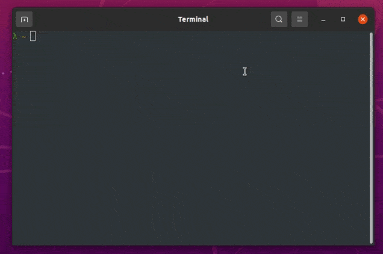

# My dotfiles


## 🚀 Installation

### ⚠️ Attention: Requirements

- If you have macOS, install [brew]("https://brew.sh/")

1. Execute installer
   ```bash
   bash <(curl -s https://raw.githubusercontent.com/franciscoruizar/dotfiles/HEAD/installer)
   ```
2. Switch to zsh shell (Optional)
    ```bash
    chsh -s $(which zsh)
    ```

## 🔰 Update
```bash
dot self update
```

## 🥳 Inspired on:

- [Dotly](https://github.com/CodelyTV/dotly)
- [rgomezcasas](https://github.com/rgomezcasas/dotfiles)

## ⚖️ License
The MIT License (MIT). Please see [License](LICENSE) for more information.
